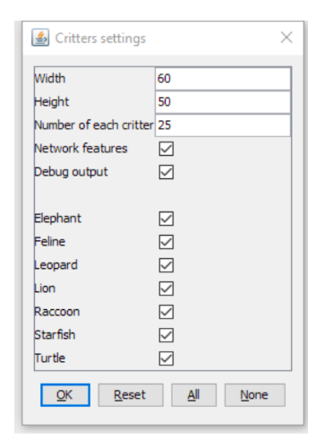

# PSA 4: Critter and Inheritance

This PSA is due November 12th, Tuesday, 11:59pm

## Introduction
**Prepare for the ultimate battle of your CSE 8B career!**

This week you'll be writing several lineages of Critters and testing your game-play strategy with Critters you design for combat. The rules are generally simple, but there are some nuances to the rules so read each part carefully. You will use inheritance and polymorphism, the new object-oriented design paradigm you learned in class, to enter various critter competitions where critters face off against each other in an arena. You will also be designing your own critter, which will go into battle against the critter creations of your fellow students.

## Starter Code:
The following files are provided:

* `Critter.java`: prototype of a critter object, contains a class of Critter and enums Direction and Attack.
* `CritterMain.java`: the critter simulator
* `Starfish.java`: Patrick Star, he lives in Bikini Bottom.
* `Feline.java`: starter code for Feline
* `Raccoon.class`, `Raccoon$Location.class`: A mysterious Critter with unknown behavior. Beat it for extra credit.

Copy the starter code using the same command as in the previous PSAs (refer to PSA 0 if you need a refresher). The starter code is located at the following path:
```
~/../public/psa4
```
Backup your code as you progress through the assignment. 

Note the starter codes do not compile by doing `javac *.java` because they are not completed. When you complete a class, you should write a tester to test your individual methods in that class. In the end, you can use `CritterMain` to run the simulation. 

## Arena & Simulation Mechanics
Several classes in the starter code implement a graphical simulation of a 2D world with many animals moving around in it. You will write a set of classes that define the behavior of these animals. For each class, you are defining the unique behaviors for each animal. 

The Critter World is divided into cells with integer coordinates. The world is 60 cells wide and 50 cells tall by default. The upper-left cell has x- and y-coordinates (0, 0). The x-coordinate **increases to the right**. The y-coordinate **increases downwards**. 


**NOTE: the following mechanics are already implemented in the Critter simulator, e.g. when two critters fight, the simulator decides who wins based on what the attack each critter uses. Your task for this assignment is to define behaviors for each critter. i.e. you just need to write the methods but don't need to call them.**

You can run the simulator to test your critter implementations.

### Movement
When it’s Critter A’s turn to move, the simulator will call `A.getMove()` to get a direction.

Each round, each Critter can move one square north, south, east, west, OR stay at its current location (i.e. center). The world has a finite size, but it wraps around in all four directions (for example, moving east from the right edge brings you back to the left edge).

### Fighting
As the simulation runs, animals may collide by moving onto the same location. When two animals collide and they are from different species, they fight. The simulator will call `getAttack()` so that the critter fighting can select which attack to use.

The winning animal survives and the losing animal is removed from the game. Each animal chooses one of `Attack.ROAR`, `Attack.POUNCE`, `Attack.SCRATCH`, or `Attack.FORFEIT` as their attack mode. Each attack will be stronger against another attack (e.g. Roar beats Scratch). If an animal decides to Attack.FORFEIT, it will automatically lose the fight.

The following table summarizes the choices and which animal will survive in each case. To remember which beats which, notice that the starting letters of "Roar, Pounce, Scratch" match those of "Rock, Paper, Scissors." If the animals make the same choice, the winner is chosen with a coin flip.


The cases above are based on the following rules:

1. Critter #1 scratches and Critter #2 roars. Critter #2 survives.
1. Critter #1 roars and Critter #2 pounces. Critter #2 survives.
1. Critter #1 pounces and Critter #2 scratches. Critter #2 survives.
1. Critter #1 and Critter #2 use a same attack in [roar, pounce, scratch, forfeit]. One of them survives, chosen randomly.
1. Critter #1 uses an attack in [roar, pounce, scratch] while Critter #2 forfeits, Critter 1 survives.

### Mating
If two animals of the same species collide, they "mate" to produce a baby. Animals are vulnerable to being attacked while mating, so any other animal that collides with them will defeat them both. An animal can mate only once during its lifetime. A “baby” will be spawned as a full adult next to its parents once they are finished mating.

The mating behavior is enforced by the simulator. However, when two critters mate, `mate()` will be called so that your critter knows it starts mating.

### Eating and Sleep
The simulation world also contains food (represented by the period character ".") for the animals to eat. There are pieces of food on the world initially, and new food slowly grows into the world over time. As an animal moves, it may encounter food, in which case the simulator will ask your animal whether it wants to eat it. Different kinds of animals have different eating behavior: some always eat, and others only eat under certain conditions. Once an animal has eaten a few pieces of food, that animal will be put to "sleep" by the simulator for a small amount of time. During the sleeping period the animal will automatically forfeit all fights, meaning it will lose to all other critters that attack it.

When a critter encounters food, the simulator will call `eat()` to ask whether the critter wants to eat or not.

The sleep behavior is enforced by the simulator. However, when a critter sleeps, `sleep()` will be called so that your critter knows it starts sleeping. Similarly, `wakeup()` will be called when your critter finishes its nap.

### Scoring
The simulator keeps a score for each class of animal, shown on the right side of the screen. A class's score is based on how many animals of that class are alive, how much food they have eaten, and how many other animals they have defeated. Detailed formula below:
```
Score = 3 x Survivor + 3 x Killed_Opponents + 1 x Food_Eaten
```

## Implementation Details (Your Task) 
Each class you write in this section will inherit from a superclass (`extends`)  and may be inherited by a subclass. We take advantage of inheritance in two ways: 
* Since subclasses automatically inherit certain methods from their superclass, if we want a certain method to be uniform across a family of classes, we can simply define the method in the superclass. 
* The other advantage is that we can _minimize the amount of code that we have to write_ which reduces the possibility of errors. Inheritance provides the programmer assistance in streamlining the code writing process.

Below is a diagram for the Critter World. Critter is an abstract class. For the purpose of this assignment, you do not need to know what that entails; we will cover it in class very soon. However, if you are curious, you can read more about it [here](https://docs.oracle.com/javase/tutorial/java/IandI/abstract.html).  All the other critters/animals are implemented as **concrete classes** (meaning they can be instantiated by using the `new` keyword).

Each class must extend Critter (or something else that extends Critter). 


### Running the Simulator
Note: Don't try doing this before you have implemented the files. It will not even compile.

We will now go through the process of running the simulator. First compile all the necessary classes (note: `Feline.java` as it is provided will not compile). You can compile separately if needed, but `javac *.java` is most convenient. Next, run the simulator with `java CritterMain`. 

The following screen will appear. Enabling “Debug output” will print the actions your critters take to the terminal. You can also choose the number of critters that initially appear in the world, and select which critters that will start in the world.




**You may see some warnings of deprecated APIs when you run the simulator. You can ignore these warnings.**

You have many options in the next screen. You can start, stop, and adjust the speed of the simulation. “Speed” controls how fast each round occurs. For visual testing, you can click Tick, which will run one round of the simulation. If you would like to toggle debug messages on your terminal as your simulation runs, click the check box for “Debug”. 


## Short-Response Questions (`README.md`)
**Read these questions before you start coding.**

You may not be able to answer some questions in the beginning (such as #3's second question) but it is helpful to keep these questions in mind when you write your program.

They may seem confusing at first, but you will find the answers as you write each critter class. Write the answers in your `README.md` and submit it to Gradescope at the end.

1. Describe the following access modifiers in 1-2 sentences total:
    * public
    * private
    * protected
    * default (_when we don’t specify an access modifier_)
1. Name one benefit of using inheritance.
1. Can we use an Object reference to point to a Starfish? What about a String reference? Why are we able to directly call `System.out.println()` and pass in a Starfish object (e.g. `System.out.println(new Starfish());`)?
1. When we create a Starfish called “Patrick”, why does `toString()` correctly return “Patrick” even though there is no `toString()` method in Starfish?
1. Can we make a "SeaUrchin" class and make it inherit from both Turtle and Starfish (let’s ignore if this is biologically possible)? Briefly explain why.
1. If we did not override Leopard's `getAttack()` method, where would it be inherited from, and what would its behavior be?
1. Why is it a good idea for Turtle override `getAttack()`?
1. Inside Ocelot, can you call Leopard’s `getColor()`? What about Feline’s `eat()`? If so, how would you make the call? 
1. Why are static variables useful? What did you use static variables for in this PSA? 
1. Describe the behavior of your own Critter in 3-4 sentences.

## Implementation

**Study the diagram provided in the earlier section carefully**. The Critter World has animals where each animal is of type **Critter**. The animal can either be of moving type (i.e. Leopard) or stationary type (i.e. Starfish). When color is involved, use the static colors that comes from the [Color](https://docs.oracle.com/javase/10/docs/api/java/awt/Color.html) class that have the same name as the color we specify.

## 1. Basic Implementation of Classes
**Read and compile Critter.java before anything else! Also read through all the methods you are supposed to implement for a class before starting to write anything for that class. These methods are related to each other most of the time! Other than Starfish.java and Feline.java, you will need to create each of the other critters' .java files from scratch.**

### Critter 
This is an abstract class defining all the possible methods that can be called on a Critter. **Do not modify this class**. You may need to override some of these methods in the other classes.

Study this class to get to know all the methods you can call, and all the instance variables you may access.

### Starfish (Free for us, well mostly)
Feel free to extend its functionality but stay within the given specification below.
```java
Starfish extends Critter
```
Starfish are very interesting creatures. One particularly interesting specimen is the lovable goof and best friend of SpongeBob Squarepants, Patrick Star. Patrick will be inhabiting our arena as a representative of the starfish. 
* **Instance variables**: None
* **No-arg constructor**: The string representation of Starfish is “Patrick”.
* **No implementation for getMove() or eat()**: Unfortunately since Spongebob isn’t around in the arena and the fact that Starfish are inherently pretty motionless creatures, there isn’t much Patrick wants to do. He decides to stick around under his rock. This means that Patrick is not interested in moving or eating, so there is no need to override `getMove()` or `eat()`.
* **No implementation for getAttack()**: Since Spongebob isn’t around, Patrick is feeling pretty chill so Starfish inherits the default Critter behavior. When Patrick is attacked, he will FORFEIT, so no need to override the `getAttack()` method. 
* **Override getColor()**: Patrick is PINK (already implemented).

### Turtle extends Critter 
* **No-arg constructor**: The string representation of Turtle is “Tu”.
* **Override getColor()**: Turtles are GREEN.
* **Override getMove()**: Turtles always move WEST.
* **Override eat()**: Turtles like to play it safe when eating. They only eat when there are no hostile animals adjacent to the Turtle (hostile animals are anything that is not an empty space, food, or Turtle).
* **Override getAttack()**: Turtles don’t always fight, but sometimes they do. Turtles attack with ROAR 50% of the time and FORFEIT the other 50%. Slow and steady wins the race, after all.

### Feline extends Critter
* **Instance variables**: Each Feline will keep track of the number of times it has moved, the amount of times it has not eaten, and the current direction it is going in. These have been provided for you.
* **No-arg constructor**: A default no-arg constructor. The Critter should not be hungry until its third encounter with food. `moveCount` should be set such that it will change to a new direction at the next (first) call to `getMove()`. This means that Feline should not start eating once it is created (look at `eat()`). The string representation of Feline is “Fe”. 
* **Override getMove()**: Felines are jumpy and tend to go in random directions, so it will go in a new  random direction (excluding CENTER) after every 3rd move that it makes. 
    * If the Feline picks NORTH as its first direction, and SOUTH as its next random direction its moves would be: NORTH, NORTH, NORTH, SOUTH, SOUTH, SOUTH .
    * NOTE: "new random direction" here means a newly chosen direction, not necessarily a unique/different direction. If Feline went NORTH for 3 moves, it should still be able to choose NORTH as its next 3 moves.
* **Override eat()**: Felines don’t need to eat that much, so every 3rd time it encounters food, it will eat.
    * NOTE: The feline will eat after 2 times of encountering food and not eating. For the first 6 times the feline encounters food, its eating pattern should be:
    false, false, **true**, false, false, **true**
* **Override getAttack()**: Felines should always POUNCE.

### Lion extends Feline
* **Instance variables**: Each Lion will keep track of the number of fights it wins until it goes to sleep, which will determine its eating behavior. Losing a fight does not decrease the instance variable. You may need a few private variables to keep track of the Lion’s movement.
* **No-arg constructor**: A default no-arg constructor. The string representation of Lion is “Lion”.
* **Override getColor()**: a Lion is YELLOW. 
* **Override getMove()**: The king of beasts does not fear other critters, and they wait for their chance to engage. A Lion will first go EAST 5 times, then SOUTH 5 times, then WEST 5 times, then NORTH 5 times (i.e. a clockwise square pattern). Think about what instance variable to initialize to keep track of its movement.
* **Override eat()**: Return true if the Lion has won _at least one fight_ since it last ate or slept. Think of the Lion as having a “hunger” that is triggered by fighting. Initially the Lion is not hungry, but winning a fight makes the Lion hungry. When a Lion is hungry, the next call to the eating method should return true. However, once the Lion has eaten OR slept (when `sleep()` is called), the future calls of `eat()` should return false until the next win. (Hint: Think about how `sleep()` would make a lion full again.)
* **Override sleep() and wakeup()**: When a Lion goes to sleep, it will reset the number of fights it won to zero, and reverse its display name to “noiL”. When it wakes up, it reverts back to “Lion”. 
    * Note: Handle the behavior of `sleep()` and `wakeup()` separately in their own respective methods.
* **Override win()**: When a Lion wins a fight, it becomes hungry. Make sure to keep track of the number of fights it wins as this affects its eating behavior. 
* **Do not override getAttack()**. It should have the same behavior as Feline.  

### Leopard extends Feline 
* **Instance variables**:  Each Leopard, in addition to the instance variables inherited from its superclasses, will all telepathically keep track of their `confidence` together. The confidence starts at 0 when the simulation starts. When the confidence of one Leopard is affected, ALL Leopards' confidence will be affected in the exact same way.  
    * **Hint:** What type of modifier can you apply to a variable to make that variable shared across all instances?
    * Make this variable `protected`.
* **No-arg constructor**: The string representation of Leopard is "Lpd".
* **Override getColor()**: Leopards are RED (for camouflage, of course).
* **Override getMove()**: The Leopard always checks its neighbors before moving. If one of the four neighbors—NORTH, SOUTH, EAST, WEST— contains either food or Starfish, then the Leopard will move towards that direction. If more than one direction has Starfish or food, then the Leopard will move towards the first found direction. If none of the directions contain Starfish or food, then the Leopard will randomly choose a direction to move (excluding CENTER). (When checking the neighbors, please follow the **N S E W** order).
* **Override eat()**: The Leopards will always have (confidence * 10)% chance of eating. For example, if confidence is at 2, then there is a 20% chance of eating.
* **Override win() and lose()**: If a Leopard wins a fight, all Leopards’ confidence will increment by one if their confidence is less than 10. If a Leopard loses, all Leopards will reduce their confidence by 1 if their confidence is greater than zero. The minimum confidence they can have is 0, and the maximum is 10.  
* **Override getAttack(String opponent)**: The Leopard will POUNCE if the opponent is Turtle or if all Leopards' confidence is greater than 5. Otherwise, the Leopard will randomly choose an attack method using `generateAttack(String opponent)`, unless the Critter is a Starfish. In the case of a Starfish opponent, the Leopard will FORFEIT.
    * You **must** create the **protected** helper method   `generateAttack(String opponent)` to randomly choose an attack method between POUNCE, SCRATCH, and ROAR unless the Critter is a Starfish. In this case, return FORFEIT.

### Ocelot extends Leopard
* **No-arg constructor**: The string representation of Ocelot is "Oce".
* **Override getColor()**: Ocelots are LIGHT GRAY.
* **Override generateAttack(String opponent)**: If the opponent is a Lion, Feline, or a Leopard, the Ocelot will SCRATCH. Otherwise, the Ocelot will POUNCE. **NOTE: This method is called from getAttack(String opponent)**
* **Do not override getAttack(String opponent)**: The Ocelot will attack in the following ways:
    * If confidence is greater than 5 or the opponent is a Turtle, the Ocelot will POUNCE
    * Otherwise, if the opponent is a Lion, Feline, or a Leopard, the Ocelot will SCRATCH. If not, the Ocelot will POUNCE. **NOTE: This takes place in `generateAttack(String opponent)`**

### Elephant extends Critter 
* **Variables**: Elephants share an int goalX and int goalY coordinate (make them protected, not private). An Elephant also has a Random object used to generating random ints when picking new goal coordinates. This Random object is an instance variable, not a static variable.
    * **Hint**: Look at the modifier for goalX and goalY. What does that mean about all Elephant objects?
* **No-arg constructor**: The string representation of Elephant is “El”. The random object must be initialized.  The very first goalX and goalY should be (0,0).
* **Override getColor()**: Elephants are GRAY.
* **Override getMove()**: Elephants are sensible creatures and know that they are safer if they move in herds. Because of this, Elephants have a precise movement pattern.
    * All elephants move towards the shared `goalX` and `goalY` coordinate in the simulation. Each Elephant moves towards their goal in the axis in which they are **further from their goal**. So if an Elephant is further from its goal in the x-axis, it would move EAST or WEST depending on the location of their goal and their current location. When an Elephant is  further from its goal in the y-axis, an Elephant would move NORTH or SOUTH. If the distances are **equal**, choose to move on either the x or y-axis (but be consistent with your choice - always choose x or always choose y).
    * If an Elephant reaches the `goalX` and `goalY`, it must change the `goalX` and `goalY` variables to a new random location on the board. Elephants should check for this at the very beginning of their `getMove()` method (and choose random new goal at that time, before choosing their move). 
    * **You do not consider the "wrap-around" case for either axis.** For example, consider the case where the world is 60x50, ElephantAlpha is at (0, 0), and the goal is at (59, 5). Then ElephantAlpha will move **EAST** because `goalX` is further than `goalY`, even though it can technically move WEST to get to the `goalX`-coordinate faster on the x-axis. The same holds true for the y-axis. 
* **Override eat()**: Out in the wild, Elephants need a lot of food, so they will always eat.
* **Override mate()**: When an Elephant mates, increment its level by 2.
* **Do not override getAttack() from the Critter class.**

## 2. Hack into the Game! 
Wouldn't it be boring if the all the critters can only play by the rules? Let's add some special effects (i.e. buff effect) to them!

You are welcome to try these effects out in your own critter but that will **NOT** be included when we run the competition.

### buffBehavior () and debuff ()
These two methods are defined in Critter class and should be overriden in some of the classes you implement.  `buffBehavior()` will add effects to the critters and `debuff()` will remove the special effects so it won't impact the normal running process.

So let's get started!

#### Starfish: "Do you know where I am?" [Sample, this is provided]
Starfish is too humble a type of animals to be discovered. Therefore in the buffBehavior method of Starfish, it gets transparent by:
* changing the display name to empty string so that you can not see them in the arena.

#### Lion: "Let me look stronger!" [TODO]
Lions are kings of animals, so the buff behavior of it will:
* change the display name temporarily to capital letters: LION.
Correspondingly, in the debuff method,
* change the display name back to Lion

#### Leopard: "I am having fun here!" [TODO]
Leopards run the fastest so they are happily wandering around. Therefore Leopard's buff behavior 
* change its' display name to: lalalala~~~~ (4 la's and 4 tildes).
Debuff mechanic is also easy. 
* change back the display name of Leopard to Lpd.

#### Ocelot: "I am having fun here too!" [TODO]
Follow the Leopard buff behavior. For the debuff method, 
* change the display name back to Oce

#### Starfish: "I am not there" [TODO] 
Although Starfish doesn't move or eat and can easily get ignored, they have one of the strongest buffs--teleporting!

In the method `teleport(Point currentLocation, Critter[][] arena)`, you will make Starfish move around the arena randomly. `currentLocation` here refers to the location of a Starfish. 

* Modify `currentLocation.x` and `currentLocation.y` directly to reset the location of a Starfish to a random coordinate within the range of the arena. The 2-D array `arena` will update automatically so you don't have to modify `arena` in this step.
* The 2-D array `arena` keeps references to different Critters at their corresponding row and column. After we modify `currentLocation`, the Starfish has been teleported but `arena` still stores a reference to the Starfish at its previous location. So remember to set the reference at location `currentLocation.x` and `currentLocation.y` in `arena` to `null`.

## 3. Critter Competition (firstName_email.java)
Up until this point you have implemented critters where we guided you through the process. Now it is time to create your own critter from scratch.

**There is no starter code for this class because the implementation is entirely up to you.**

here will be a competition between every Critter that all students submit. Therefore, we need a viable way of identifying your Critter. The filename needs to include your first name and your UCSD email address without the domain to be entered into the competition (firstName_email.java -- for example, if your name is Thanos and your email is abc001@ucsd.edu, then submit Thanos_abc001.java). However, you may make your Critter’s display name (inside the simulation) anything. **The display name must be appropriate.**

In order to receive full credit for this part of the PSA, your Critter, at a **minimum** must have its:
* own display name
* color choice (`getColor()`)
* override the `getMove()` and `getAttack()` methods
* inherit from proper classes as described in the diagram in the previous section

You should aim to make it as strong as possible. Be sure to test out your Critter's strength with various critter combinations that you implemented from the previous parts. **Do not override `debuff()` or `buffBehavior()`.**

### Competition Details
In the competition, your Critter will compete against other student’s Critters. We will run a single simulation in class with many Critters from every student to see whose Critter will come out on top. The simulation will not include any of the Critters from this PSA (e.g. Elephant, Feline, etc.). While strategy may be a large portion of probable success, luck is also a major portion! There will be only one run of the entire competition, with the default number of instances of every student’s Critter inside the simulation. 

**The top 3 contestants of each section of the competition will receive a MYSTERY prize. May the odds be ever in your favor. May the force be with you.**

## Extra Credit
We have provided for you a `Raccoon.class` file. This very dangerous critter emerged from the depths of UCSD’s Sixth College. 

For extra credit points, your critter implementation must be able to defeat the Raccoon consistently. You are not given the .java file, so you cannot look at the code to see the Raccoon’s weaknesses. Instead, you should study its behavior in battle to see what steps your critter should take to defeat it. **Again, you cannot override debuff() or buffBehavior().**

Grading
The grading for the Extra Credit will be slightly different. **Your Critter may not win the simulation every time**. Therefore, you need to ensure that your Critter performs with great strength in order to beat the odds. We run each student’s Critter with different scenarios -- the Critter with the highest score at the end of 1000 ticks wins. **Regrade requests for rerunning the simulation will be rejected.** There will be **three** runs of the simulation. 

To be confident that your critter will win two times (for full credit and half credit for one win), you should ensure that your Critter can win in your simulations most, if not all, of the time. If your Critter wins two out of three simulations, you will earn full credit. If your Critter wins only one time, you will still earn half credit.

## Style and Submission
### Style
A full style guideline can be found [here](https://sites.google.com/eng.ucsd.edu/cse-8b/programming-assignments/style-guidelines?authuser=0).

Make sure to follow all of the rules mentioned. Grading is based on all 10 requirements and is strictly enforced.

### Submission
Start early, as most of the challenge will be in getting your code to match our specifications!

Make sure your submission contains all of the files and that they work on the ieng6 lab machines! 
* `README.md` (10 questions)
* Starfish.java
* Turtle.java
* Feline.java
* Leopard.java
* Ocelot.java
* Lion.java
* Elephant.java
* FirstName_email.java (Please replace "FirstName" with your own first name and "email" with your own email address, without the domain)


